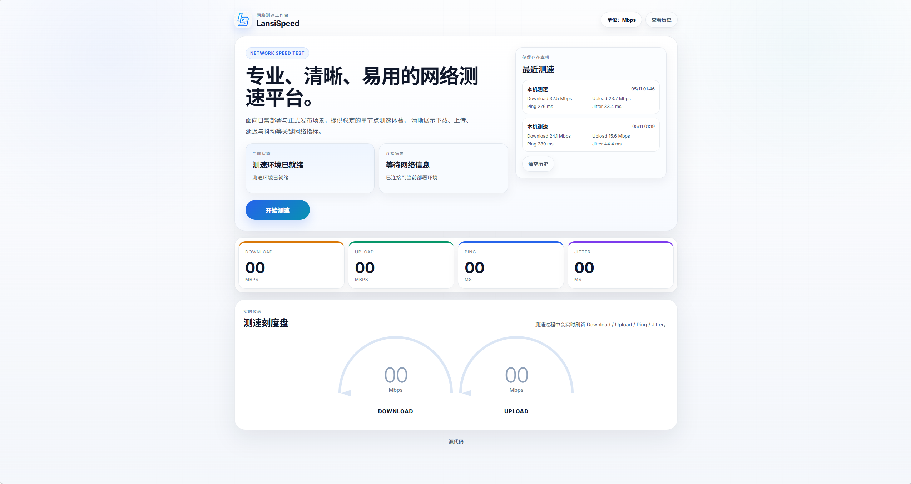
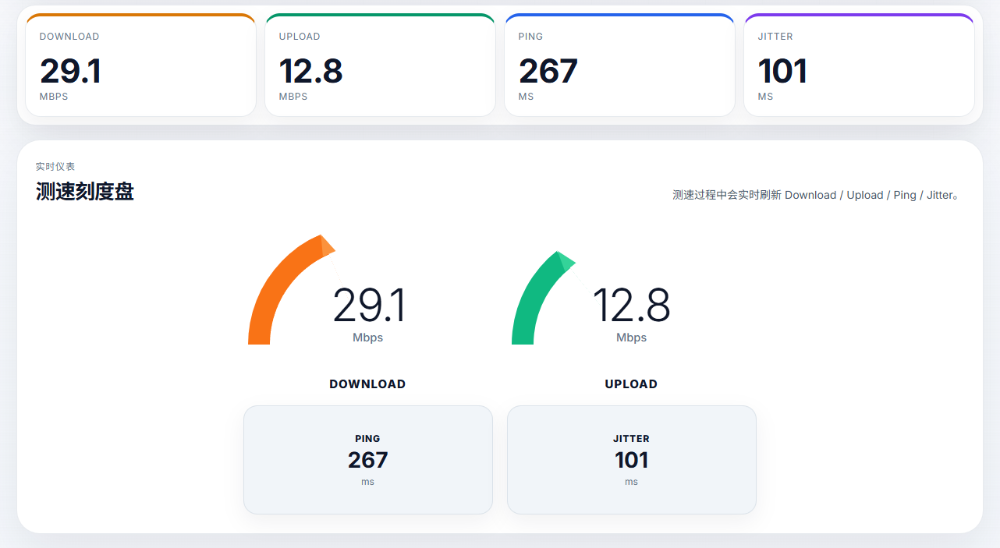

# LansiSpeed

LansiSpeed 是一个基于 [LibreSpeed](https://github.com/librespeed/speedtest) 修改而来的单节点测速项目。

本仓库保留了 LibreSpeed 的核心测速引擎与基础 PHP 后端，并在此前提下对前端界面、交互方式和功能范围做了定制，面向更轻量的自部署使用场景。

## 项目说明

当前版本的目标不是完整复刻官方 LibreSpeed，而是提供一个：

- 更适合单节点部署的测速页面
- 更轻量的前端结构
- 更简化的后端依赖
- 更容易直接上线使用的中文界面

## 相比上游的主要改动

- 重做了前端 UI
- 改为单节点测速模式
- 移除了多节点服务器选择
- 移除了 telemetry、结果分享和数据库结果页
- 简化了 `getIP.php`，默认仅返回客户端 IP
- 增加了浏览器本地测速历史记录
- 增加了 `Mbps` / `MB/s` 单位切换
- 将当前定制界面的品牌名称调整为 `LansiSpeed`

## 目录结构

- `index-modern.html`：主入口页面
- `frontend/`：前端页面、样式、字体、图标和脚本
- `backend/`：测速所需的 PHP 接口
- `speedtest.js`：LibreSpeed 前端控制层
- `speedtest_worker.js`：LibreSpeed 核心测速 Worker

## 运行要求

- 支持 PHP 的 Web 服务器，例如 Nginx、Apache、IIS
- 能正常访问 `backend/` 目录中的 PHP 文件
- 服务器具备基础网络带宽条件

注意：

本项目可以通过 `file://` 直接预览页面样式，但**不能通过本地文件方式完成真实测速**。  
真实测速必须通过 HTTP 或 HTTPS 访问，因为测速过程依赖以下后端接口：

- `backend/garbage.php`
- `backend/empty.php`
- `backend/getIP.php`

## 部署方式

1. 将仓库文件上传到网站目录
2. 确保服务器已启用 PHP
3. 确保 `backend/` 目录中的 PHP 文件可以正常执行
4. 通过浏览器访问：
   - `index-modern.html`
   - 或将 `index.html` 作为站点入口

建议上线前至少检查以下文件是否可正常访问：

- `speedtest.js`
- `speedtest_worker.js`
- `backend/garbage.php`
- `backend/empty.php`
- `backend/getIP.php`

## 关于上游项目

LibreSpeed 官方仓库：

- [https://github.com/librespeed/speedtest](https://github.com/librespeed/speedtest)

如果你需要以下能力，建议直接使用上游官方版本：

- 多节点测速
- telemetry 数据采集
- 结果分享图片
- 数据库存储结果
- Docker 工作流
- 官方示例与完整文档

## 开源来源与致谢

本项目基于以下开源项目修改而来：

- **LibreSpeed**
- 作者：Federico Dossena
- 上游仓库：[https://github.com/librespeed/speedtest](https://github.com/librespeed/speedtest)

本仓库包含对原项目代码的修改版本，核心测速逻辑与部分基础文件来源于 LibreSpeed。

## 许可证说明

本仓库包含基于 LibreSpeed 修改而来的代码，整体遵循与上游一致的许可证：

- **GNU Lesser General Public License v3.0 or later**
- 即：**LGPL-3.0-or-later**

请参阅：

- [LICENSE](./LICENSE)

## 使用与再发布说明

如果你基于本仓库继续修改、部署或再发布，建议保留以下内容：

- 上游 LibreSpeed 的来源说明
- 原始许可证文件 `LICENSE`
- 对修改部分的说明

如果你准备将本仓库公开发布到 GitHub，建议在仓库首页明确写明：

- 本项目不是 LibreSpeed 官方仓库
- 本项目是基于 LibreSpeed 的修改版本
- 保留上游许可证与版权说明
